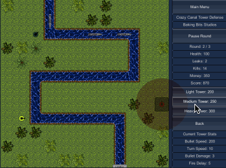

# Tower Defense

This is a tower defense game written in C# using Unity. [Play](http://andrew-boutin.github.io/tower-defense) on GitHub Pages!

In Crazy Canal Tower Defense, your objective is to strategically place defense towers to prevent enemy water craft from reaching the end of the canal!

---

Check out my [personal website](https://andrewboutin.com)!
